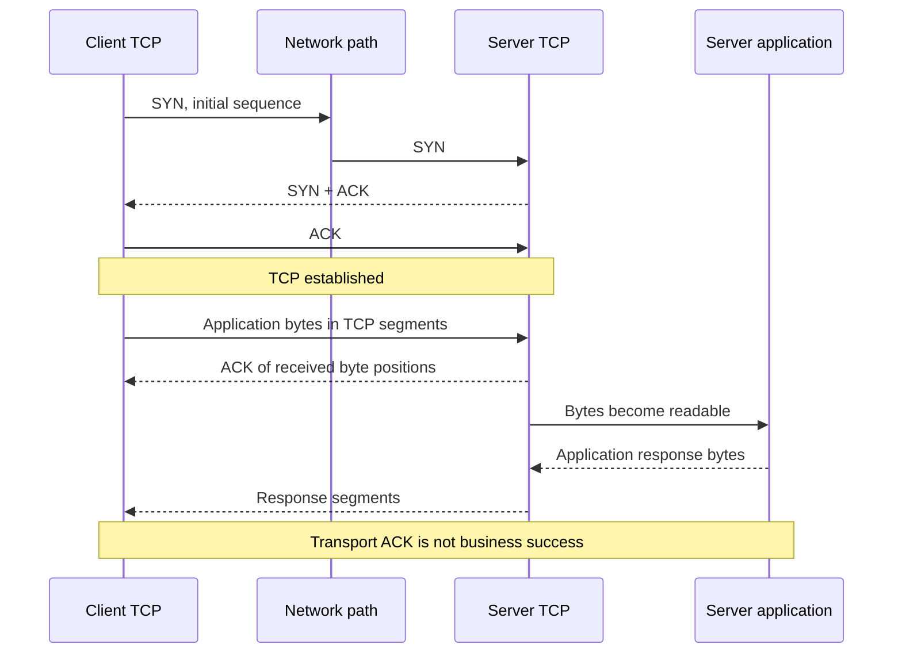
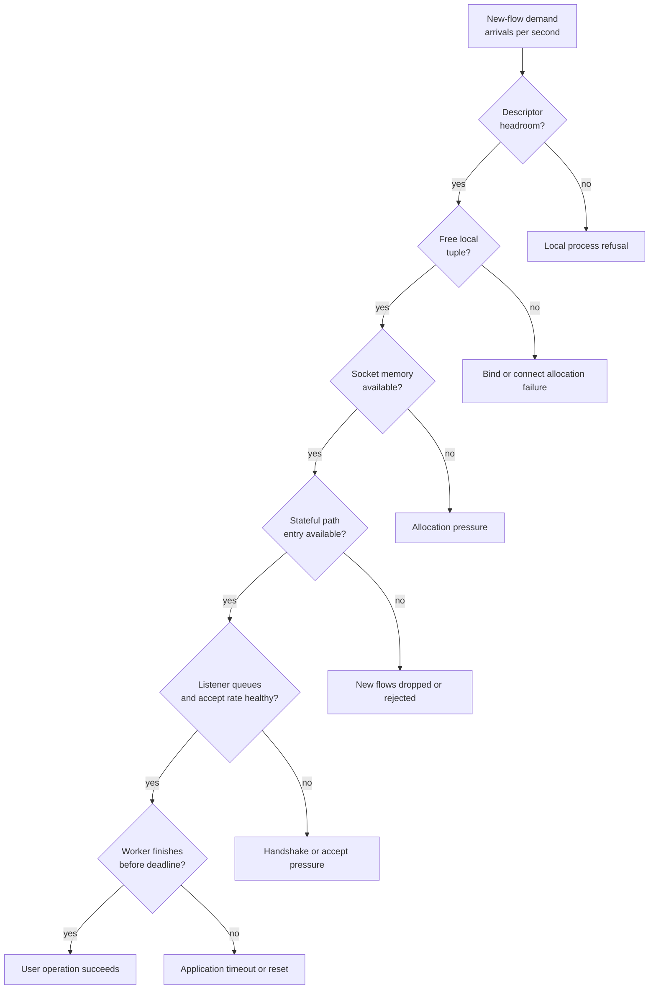
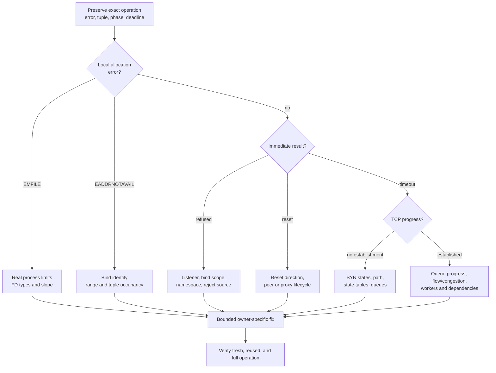

---
{
  "schemaVersion": 1,
  "kind": "lesson",
  "id": "LES-0013",
  "aliases": ["V02-L02", "tcp-udp-sockets-exhaustion"],
  "curriculumIds": ["NET-007"],
  "slug": "tcp-udp-sockets-exhaustion",
  "route": "/book/connectivity/tcp-udp-sockets-exhaustion",
  "order": 2,
  "volume": "02-connectivity",
  "title": "TCP, UDP, sockets, and exhaustion: find the owner of a failed connection",
  "summary": "Turn connection refused, reset, timeout, queue pressure, TIME_WAIT growth, ephemeral-port exhaustion, descriptor limits, socket memory pressure, and stateful-network limits into separate evidence paths instead of one vague network problem.",
  "domain": "connectivity",
  "level": {
    "from": "foundation",
    "to": "advanced"
  },
  "estimatedMinutes": 360,
  "prerequisiteLessonIds": ["LES-0012", "LES-0004"],
  "prerequisiteCurriculumIds": ["NET-001", "NET-002", "NET-003", "NET-004", "NET-005", "NET-006"],
  "testedEnvironments": [
    {
      "platform": "Ubuntu",
      "version": "24.04 LTS",
      "support": "required",
      "notes": "Host observations are read-only and run as a normal user. The required lab uses Bash and Python 3.8 or newer, deterministic virtual evidence, a guarded UID-scoped directory under /tmp, no real listener, no network traffic, no sysctl change, and no firewall or route mutation."
    },
    {
      "platform": "Windows Subsystem for Linux (WSL 2) Ubuntu",
      "version": "24.04 LTS",
      "support": "supported",
      "notes": "The offline lab is supported. WSL 2 has a Linux utility-VM network boundary, so host socket tables and localhost reachability must be interpreted within the exact Windows or Linux namespace where the command ran."
    },
    {
      "platform": "Containers, Kubernetes, private cloud, and public cloud",
      "version": "provider-neutral concepts",
      "support": "concept-only",
      "notes": "Production transfer explains namespaces, proxies, Services, load balancers, NAT, connection tracking, and multi-layer queue ownership, but this lesson creates no container, cluster, cloud resource, firewall rule, or real transport load."
    }
  ],
  "targetRoles": [
    "site-reliability-engineer",
    "devops-engineer",
    "platform-engineer",
    "production-engineer",
    "network-reliability-engineer",
    "cloud-infrastructure-engineer",
    "private-cloud-engineer",
    "data-platform-engineer"
  ],
  "learningObjectives": [
    "Distinguish a process file descriptor, kernel socket object, bound endpoint, listener, accepted connection, transport tuple, and user operation without using the words socket or connection as if they were one object.",
    "Trace TCP establishment, byte sequencing, acknowledgment, retransmission, flow control, congestion control, graceful close, reset, and TIME_WAIT ownership from observable evidence.",
    "Explain UDP datagram boundaries and why a successful send, an open-looking port, or a missing reply cannot by itself prove application delivery, return-path health, or remote processing.",
    "Separate listen backlog, SYN queue, accept queue, application worker, descriptor, ephemeral-port, socket-memory, NAT, and connection-tracking pressure by scope and owner.",
    "Decode ss, procfs, and read-only sysctl evidence with units, namespaces, point-in-time limitations, and counters instead of treating one command as a diagnosis.",
    "Use refusal, reset, timeout, and success timing to choose the next evidence boundary while preserving the exact failed operation and client-server direction.",
    "Estimate transport capacity using tuple uniqueness, arrival rate, residence time, queue depth, and percentiles while stating assumptions and distributions.",
    "Plan bounded remediation, rollback, verification, alerting, security, and prevention for local, containerized, Kubernetes, and stateful network paths."
  ],
  "productionSignals": [
    "A client receives connection refused immediately while a dashboard claims the service is healthy.",
    "Connections time out only during bursts even though average CPU and average request rate look normal.",
    "The server has a listening socket but accept latency, listen drops, or application queue time rises.",
    "One client host fails to create new outbound connections while existing connections continue to work.",
    "TIME_WAIT or another TCP state grows rapidly after a retry, keepalive, proxy, or deployment change.",
    "The process reports too many open files, cannot allocate memory, or cannot assign requested address while disk and CPU remain healthy.",
    "UDP send calls succeed but responses disappear, arrive late, arrive out of order, or are truncated by application behavior.",
    "Only new flows fail across a firewall, NAT gateway, load balancer, node, or service mesh while established flows remain healthy."
  ],
  "diagrams": [
    {
      "id": "LES-0013-DIA-001",
      "title": "A user operation crosses several separately owned transport objects",
      "direction": "left-to-right",
      "boundaries": ["client operation", "client file descriptor", "client kernel socket", "source endpoint and ephemeral port", "stateful network path", "server listen socket", "SYN and accept queues", "accepted server socket", "worker and application response"],
      "evidencePoints": ["operation deadline", "process and descriptor", "TCP or UDP state", "four-tuple or five-tuple", "NAT or connection-tracking state", "LISTEN owner", "queue occupancy and overflow counters", "established child socket", "application latency and outcome"],
      "textAlternative": "A client operation uses a process descriptor that refers to a kernel socket; the kernel chooses an endpoint and crosses stateful network boundaries before a server listener and its queues create an accepted child socket for an application worker."
    },
    {
      "id": "LES-0013-DIA-002",
      "title": "TCP establishment and close are directional state machines",
      "direction": "top-to-bottom",
      "boundaries": ["client CLOSED", "client SYN-SENT and server SYN-RECEIVED", "both ESTABLISHED", "one side initiates active close", "peer acknowledges and closes", "active closer TIME-WAIT", "tuple safely reusable"],
      "evidencePoints": ["SYN", "SYN plus ACK", "final ACK", "sequence and acknowledgment progress", "FIN or RST", "TIME_WAIT count and local endpoint", "maximum-segment-lifetime safety interval"],
      "textAlternative": "TCP moves through a handshake to established byte-stream state; a graceful close exchanges FIN and acknowledgments, and the endpoint that actively closes normally holds TIME_WAIT so delayed duplicate segments cannot corrupt a later connection using the same tuple."
    },
    {
      "id": "LES-0013-DIA-003",
      "title": "New-flow capacity is the minimum of several independent budgets",
      "direction": "hierarchical",
      "boundaries": ["application demand", "process descriptor budget", "local ephemeral-port and tuple budget", "socket memory", "listen and application queues", "NAT or connection-tracking budget", "downstream listener and workers"],
      "evidencePoints": ["arrival rate", "open descriptors", "ports by destination", "per-socket and protocol memory", "backlog occupancy and drops", "state-table entries and insert failures", "accept rate and service time"],
      "textAlternative": "Successful new connections require every budget to have room; increasing one limit cannot repair exhaustion owned by another process, namespace, host, proxy, or network appliance."
    }
  ],
  "commands": [
    {
      "id": "LES-0013-CMD-001",
      "question": "Which operating system, kernel, identity, network namespace, and tools define this observation?",
      "risk": "read-only",
      "command": "cat /etc/os-release; uname -sr; id; readlink /proc/self/ns/net; command -v ss python3 bash",
      "runFrom": "The exact Ubuntu 24.04 or WSL 2 Ubuntu shell being investigated",
      "expectedBranches": [
        {
          "when": "Ubuntu 24.04, a normal user, one namespace identity, and required commands are visible",
          "meaning": "The required observation baseline exists for this shell.",
          "nextEvidence": "Record whether the failing process shares this network namespace before reading socket tables."
        },
        {
          "when": "The release, privilege, namespace, or tool set differs",
          "meaning": "The evidence boundary differs from the lesson baseline.",
          "nextEvidence": "Stop the lab if dependencies or identity fail; do not elevate or install automatically."
        }
      ],
      "proves": "The displayed platform metadata, effective identity, current process network-namespace link, and command visibility at that moment.",
      "doesNotProve": "That the failing process shares the namespace, that a listener exists, that traffic flows, or that any limit is exhausted."
    },
    {
      "id": "LES-0013-CMD-002",
      "question": "Which TCP listeners exist here, who owns them when visible, and what backlog values are sampled?",
      "risk": "read-only",
      "command": "ss -lntp",
      "runFrom": "The server's exact network namespace; process details may require ownership or authorized privilege",
      "expectedBranches": [
        {
          "when": "The intended local address and port appear in LISTEN",
          "meaning": "A TCP listen socket exists in this namespace at sample time.",
          "nextEvidence": "Decode local bind scope, Recv-Q, Send-Q, process ownership, and then test the exact client path."
        },
        {
          "when": "The endpoint is absent or bound only to another address family or interface",
          "meaning": "The expected listener is absent from this namespace or its bind scope differs.",
          "nextEvidence": "Verify process, namespace, deployment readiness, and bind configuration before changing the network."
        }
      ],
      "proves": "A sampled kernel view of TCP listeners and permitted ownership details in the current namespace.",
      "doesNotProve": "That a worker will accept promptly, that policy permits a remote client, that the application is ready, or that the printed queues never overflowed."
    },
    {
      "id": "LES-0013-CMD-003",
      "question": "How many TCP sockets occupy each visible state in this namespace?",
      "risk": "read-only",
      "command": "ss -s",
      "runFrom": "The investigated network namespace as a normal user",
      "expectedBranches": [
        {
          "when": "One state is materially above its own baseline",
          "meaning": "The namespace has unusual state occupancy at the sample time.",
          "nextEvidence": "Filter that state, identify local and peer endpoints, process ownership, age, and whether the count is rising."
        },
        {
          "when": "Counts look normal",
          "meaning": "No visible state-count anomaly exists in this snapshot.",
          "nextEvidence": "Correlate with the failure interval; a burst, another namespace, or an upstream state table may be missing."
        }
      ],
      "proves": "A point-in-time summary of socket states visible in this namespace.",
      "doesNotProve": "Historical peaks, socket ownership, root cause, remote state, queue overflow, application success, or a safe tuning value."
    },
    {
      "id": "LES-0013-CMD-004",
      "question": "Which established TCP endpoints, timers, processes, and memory fields are visible?",
      "risk": "sampled-read-only",
      "command": "ss -tinmp state established",
      "runFrom": "The exact namespace during a short, authorized sample; output can contain sensitive addresses and process names",
      "expectedBranches": [
        {
          "when": "RTT, retransmission, send-queue, receive-queue, or memory fields differ for affected peers",
          "meaning": "The affected connection population has transport evidence that can be correlated with path and application timing.",
          "nextEvidence": "Compare the same fields by destination, instance, and time window; protect the captured endpoint data."
        },
        {
          "when": "No affected connections are visible",
          "meaning": "Connections may fail before establishment, finish too quickly, live elsewhere, or be hidden by permissions.",
          "nextEvidence": "Inspect listener and SYN states, client-side evidence, and namespace identity."
        }
      ],
      "proves": "Sampled fields for visible established sockets, subject to kernel version and permission.",
      "doesNotProve": "Packet loss location, whether retransmission is caused by congestion, remote application health, or end-to-end user success."
    },
    {
      "id": "LES-0013-CMD-005",
      "question": "Are sockets accumulating in SYN-SENT, SYN-RECV, TIME-WAIT, CLOSE-WAIT, or another specific state?",
      "risk": "read-only",
      "command": "ss -tan state syn-sent; ss -tan state syn-recv; ss -tan state time-wait; ss -tan state close-wait",
      "runFrom": "The client or server namespace whose state ownership is being tested",
      "expectedBranches": [
        {
          "when": "A state and endpoint population rises with the incident",
          "meaning": "That lifecycle boundary is retaining sockets or awaiting progress.",
          "nextEvidence": "Determine direction, owning process, residence time, arrival rate, and the event required to leave that state."
        },
        {
          "when": "The suspected state is absent",
          "meaning": "The hypothesis is unsupported in this namespace and instant.",
          "nextEvidence": "Check the other endpoint, a proxy or node namespace, counters across the interval, and the precise error returned."
        }
      ],
      "proves": "Which matching socket records are visible at lookup time.",
      "doesNotProve": "That every entry is harmful, that a high count means exhaustion, or that deleting state is safe."
    },
    {
      "id": "LES-0013-CMD-006",
      "question": "What local ephemeral-port range can this namespace allocate automatically?",
      "risk": "read-only",
      "command": "sysctl -n net.ipv4.ip_local_port_range; cat /proc/sys/net/ipv4/ip_local_reserved_ports",
      "runFrom": "The client network namespace; read only",
      "expectedBranches": [
        {
          "when": "A lower and upper port plus optional reservations print",
          "meaning": "The configured automatic local-port interval and explicit reservations are known for this namespace.",
          "nextEvidence": "Calculate inclusive candidate count, subtract reservations, then measure occupancy by destination and address."
        },
        {
          "when": "Values are unavailable or unexpected",
          "meaning": "Visibility, platform, or namespace configuration differs.",
          "nextEvidence": "Record the limitation; do not write sysctls to force the lesson example."
        }
      ],
      "proves": "Configured port-range boundaries and reserved-port text visible to the command.",
      "doesNotProve": "Free tuple count, allocation success, NAT capacity, safe enlargement, or how many simultaneous connections all destinations can support."
    },
    {
      "id": "LES-0013-CMD-007",
      "question": "What descriptor ceiling applies to this shell and how many descriptors does one authorized process currently hold?",
      "risk": "read-only",
      "command": "ulimit -Sn; ulimit -Hn; ls -1 /proc/$$/fd | wc -l",
      "runFrom": "The same service launch context when possible; `$$` selects the current shell PID for this observation",
      "expectedBranches": [
        {
          "when": "Usage approaches the applicable soft limit",
          "meaning": "Descriptor budget is a plausible local process boundary.",
          "nextEvidence": "Sample the actual service PID with authorization, classify descriptor types, and inspect leak or concurrency behavior."
        },
        {
          "when": "Substantial headroom remains",
          "meaning": "This shell's descriptor budget is not exhausted.",
          "nextEvidence": "Do not transfer that conclusion to another process; inspect its limits and other budgets."
        }
      ],
      "proves": "The current shell's soft and hard open-file limits and a racy point-in-time count of entries in that shell PID's descriptor directory.",
      "doesNotProve": "The service process limit, socket-only count, system-wide file-table capacity, or absence of a brief peak."
    },
    {
      "id": "LES-0013-CMD-008",
      "question": "What TCP listen and socket-buffer ceilings are configured in this namespace?",
      "risk": "read-only",
      "command": "sysctl net.core.somaxconn net.ipv4.tcp_max_syn_backlog net.core.rmem_max net.core.wmem_max",
      "runFrom": "The server namespace as a normal user; read only",
      "expectedBranches": [
        {
          "when": "All values print",
          "meaning": "The configured ceilings are now known.",
          "nextEvidence": "Compare them with application backlog arguments, queue samples, overflow counters, memory budget, arrival rate, and accept rate."
        },
        {
          "when": "A key is absent or permission is denied",
          "meaning": "Kernel version, platform, or visibility differs.",
          "nextEvidence": "Use version-matched documentation and authorized platform telemetry; do not assume a default."
        }
      ],
      "proves": "The printed configuration values at sample time.",
      "doesNotProve": "Actual queue occupancy, effective application backlog, pressure cause, or that increasing any ceiling is safe."
    },
    {
      "id": "LES-0013-CMD-009",
      "question": "Are Linux transport counters changing across the failure window?",
      "risk": "sampled-read-only",
      "command": "grep -E '^(Tcp:|TcpExt:|Udp:)' /proc/net/snmp /proc/net/netstat",
      "runFrom": "The relevant network namespace; take two timestamped samples and compute deltas outside the incident host",
      "expectedBranches": [
        {
          "when": "Relevant failure, retransmission, overflow, reset, or UDP error counters increase",
          "meaning": "The kernel recorded events during the interval, with scope determined by the exposed counter set.",
          "nextEvidence": "Decode exact header-to-value alignment, counter semantics, namespace scope, and correlate deltas with attempts."
        },
        {
          "when": "Counters do not change",
          "meaning": "This counter family and observation scope did not record the suspected event.",
          "nextEvidence": "Check the peer, proxy, node, stateful device, application, and whether the operation reached this stack."
        }
      ],
      "proves": "Raw cumulative counter rows exposed by procfs at each sample.",
      "doesNotProve": "Which process or request caused a delta, whether averages hide bursts, or where along a multi-hop path the event originated."
    },
    {
      "id": "LES-0013-CMD-010",
      "question": "What protocol socket-memory summary does the kernel expose?",
      "risk": "read-only",
      "command": "cat /proc/net/sockstat; cat /proc/net/sockstat6",
      "runFrom": "The investigated namespace; read only",
      "expectedBranches": [
        {
          "when": "TCP, UDP, or memory page counts rise with failures",
          "meaning": "Protocol-level socket population or allocated pages changed in this scope.",
          "nextEvidence": "Convert pages with the actual page size where required, inspect process/cgroup memory, and identify the owning socket population."
        },
        {
          "when": "Values are stable",
          "meaning": "No sustained change appears in this summary.",
          "nextEvidence": "Use time-aligned finer evidence; a short burst, different namespace, or non-memory budget may own the failure."
        }
      ],
      "proves": "The kernel's sampled protocol socket and memory summary for the visible stack.",
      "doesNotProve": "Per-process ownership, leak identity, memory-limit headroom, allocation success, or safe buffer tuning."
    },
    {
      "id": "LES-0013-CMD-011",
      "question": "Does a deliberately owned local TCP endpoint accept a connection, refuse immediately, or exceed a short deadline?",
      "risk": "sampled-read-only",
      "command": "if command -v nc >/dev/null 2>&1; then nc -vz -w 2 127.0.0.1 8080; else printf 'nc unavailable; skip rather than install\\n'; fi",
      "runFrom": "Only after confirming 127.0.0.1:8080 is an authorized disposable local endpoint; never substitute a production target casually",
      "expectedBranches": [
        {
          "when": "The connect succeeds",
          "meaning": "A TCP handshake to that exact local address and port completed within the tool deadline.",
          "nextEvidence": "Use an application-aware probe if the user operation is still failing."
        },
        {
          "when": "The connect is refused, times out, or the tool is absent",
          "meaning": "The kernel returned a refusal, no decisive result arrived before the deadline, or no probe ran.",
          "nextEvidence": "Correlate listener state, namespace, policy, packet path, and timestamps; do not install a tool during an incident automatically."
        }
      ],
      "proves": "At most, the observed outcome of one authorized TCP connection attempt to one loopback endpoint under one deadline.",
      "doesNotProve": "Remote reachability, HTTP health, sustained capacity, UDP behavior, all address families, or production readiness."
    },
    {
      "id": "LES-0013-CMD-012",
      "question": "Can an owned HTTP endpoint complete an application request and reveal phase timing?",
      "risk": "sampled-read-only",
      "command": "if command -v curl >/dev/null 2>&1; then curl --fail --silent --show-error --max-time 3 --connect-timeout 1 -o /dev/null -w 'connect=%{time_connect} starttransfer=%{time_starttransfer} total=%{time_total} code=%{http_code}\\n' http://127.0.0.1:8080/health; else printf 'curl unavailable; skip rather than install\\n'; fi",
      "runFrom": "Only against a deliberately owned local test service whose health contract permits this request",
      "expectedBranches": [
        {
          "when": "A contract-approved success code returns with bounded phase timings",
          "meaning": "DNS was bypassed and this local TCP plus HTTP operation completed for one sample.",
          "nextEvidence": "Compare distribution and dependency health if the real user path remains impaired."
        },
        {
          "when": "Connect fails, deadline expires, HTTP fails, or curl is absent",
          "meaning": "The operation failed at or after a phase boundary, or did not run.",
          "nextEvidence": "Preserve stderr, exit status, timing, listener evidence, and application logs before choosing a remediation."
        }
      ],
      "proves": "One local HTTP operation's exit result and client-observed timing fields when curl ran.",
      "doesNotProve": "Remote load-balancer behavior, all replicas, production SLO compliance, root cause, or future availability."
    }
  ],
  "labs": [
    {
      "id": "LES-0013-LAB-001",
      "title": "Diagnose a modeled transport-capacity incident without touching the host network",
      "mode": "guided",
      "environment": "Ubuntu 24.04 or WSL 2 Ubuntu 24.04 with Bash and Python 3.8 or newer",
      "timeMinutes": 50,
      "privilege": "Normal user only; root is refused",
      "network": "None; deterministic virtual evidence only",
      "changes": ["One validated UID-scoped state descriptor under /tmp", "One validated private lesson directory under /tmp", "Small allowlisted evidence files inside that directory"],
      "abortConditions": ["Effective UID is zero", "/tmp is not a real root-owned sticky directory", "A state path, owner, link count, mode, manifest, fixture digest, or allowlisted artifact check fails", "Any dependency is absent"],
      "recovery": "Use bash lab.sh recover only after interpreting evidence, then bash lab.sh verify-operation and bash lab.sh cleanup; never remove a discovered path manually.",
      "cleanupProof": "The guarded cleanup validates every registered artifact, removes only the allowlist, removes the exact empty registered root and descriptor, and check reports state=absent.",
      "path": "book/labs/LES-0013-transport-path"
    },
    {
      "id": "LES-0013-LAB-002",
      "title": "Independent transport failure localization with answer-isolated evidence",
      "mode": "independent",
      "environment": "A clean normal-user Ubuntu 24.04 or supported WSL 2 Ubuntu shell",
      "timeMinutes": 70,
      "privilege": "Normal user only; no sudo, capabilities, namespace entry, or runtime socket",
      "network": "None; the independent case does not create or contact an endpoint",
      "changes": ["The same guarded lab-owned state boundary as the guided case", "A neutral independent case identifier", "Learner notes stored outside the lab state and never read by the verifier"],
      "abortConditions": ["Any guard refuses", "A second active case is requested", "An unexpected artifact is found", "The learner cannot state an exact failed operation and evidence scope"],
      "recovery": "Choose a bounded modeled recovery only after producing a hypothesis and disconfirming test, verify the user operation separately, and clean through the script.",
      "cleanupProof": "The verifier exercises both cases, symlink and descriptor redirection refusal, unexpected-artifact refusal, root refusal as a separate test, answer-isolation checks, and final absence.",
      "path": "book/labs/LES-0013-transport-path"
    }
  ],
  "incidents": [
    {
      "id": "LES-0013-INC-001",
      "signal": "A checkout client reports connect timeout during bursts; established connections remain healthy, client SYN-SENT rises, and one egress translation tier reports new-flow insert failures.",
      "firstThought": "Treat this as a new-flow state-allocation problem until disproved, then compare client tuple supply, node state, translation capacity, destination listener, and return path in the same interval.",
      "safePath": "Preserve operation timing and tuple direction; compare affected and healthy clients; sample client states and port range; inspect authorized NAT or connection-tracking occupancy and insert-failure counters; bound retries; shift only approved traffic; verify new and established flows separately; roll back if errors or state pressure worsen.",
      "trap": "Increasing server backlog, widening client ports, deleting connection state, or restarting every client before proving which state table rejected allocation."
    },
    {
      "id": "LES-0013-INC-002",
      "signal": "A server still shows LISTEN, but connection refusal and timeout alternate during a deployment; listen-overflow deltas, accept latency, and worker saturation rise on only the new replicas.",
      "firstThought": "A listener is necessary but not sufficient: separate bind and readiness, handshake queues, completed accept queue, application accept rate, worker capacity, and graceful-drain behavior per replica.",
      "safePath": "Remove unhealthy replicas from new traffic through the approved orchestrator path; preserve per-replica listener, queue, counter, and application evidence; compare rollout configuration; roll back the change; verify fresh connections and full requests; then correct readiness, backlog, accept loop, or worker sizing at the evidenced owner.",
      "trap": "Calling LISTEN healthy, raising somaxconn globally, disabling retries, or killing TIME_WAIT entries without showing that the changed boundary owns the failed user operation."
    }
  ],
  "assessmentIds": ["ASM-0022", "ASM-0023", "ASM-0024"],
  "referenceIds": ["REF-0057", "REF-0058", "REF-0059", "REF-0060", "REF-0061", "REF-0062", "REF-0063", "REF-0064"],
  "contentStatus": "substantive-draft",
  "masteryBoundary": "publication-does-not-award-mastery",
  "lastReviewed": "2026-08-02",
  "reviewAfter": "2027-02-02",
  "limitations": [
    "The required lab is a deterministic model and never proves behavior of the learner's host, a real TCP/IP stack under load, Kubernetes, a load balancer, a NAT gateway, connection tracking, or a production application.",
    "Read-only host commands are point-in-time observations whose fields, permissions, namespace scope, and counter availability vary by kernel and platform.",
    "Packet capture, eBPF tracing, firewall inspection, conntrack administration, load generation, sysctl mutation, and production remediation require separate authorization and are deliberately not executed here.",
    "Capacity examples teach dimensional reasoning; production limits require measured workload distributions, safety margins, failure-domain analysis, and reviewed rollback plans.",
    "Completing or publishing this lesson does not award mastery; transfer evidence and human review remain required."
  ]
}
---

# TCP, UDP, sockets, and exhaustion: find the owner of a failed connection

## What you see and first thought

You see `connection refused`, `connection reset by peer`, `connect timed out`, `cannot assign requested address`, `too many open files`, or simply "the API is hanging." The tempting sentence is: **the network is down**. That sentence is too large to be useful.

Your first move is to preserve the exact operation and the exact error. A client opening a new TCP connection is not the same operation as a client reusing an established connection. Sending a UDP datagram is not the same as receiving an application reply. A server having a listening socket is not the same as a worker accepting and processing a request. Every one of those boundaries can fail while the others remain healthy.

Keep this sentence in memory:

> A transport failure is not one pipe breaking. It is a chain of separately owned state allocations and state transitions. Find the first transition that did not happen.

Start with six facts:

1. What did the user or caller attempt: connect, accept, read, write, close, or complete a request?
2. Which protocol and address family were used: TCP or UDP, IPv4 or IPv6?
3. Which source and destination endpoints were involved?
4. Which process, container, pod, node, proxy, or network device owned each visible state?
5. What exact error and duration did the caller observe?
6. Did existing flows and new flows behave differently?

That last question is especially powerful. If established flows work while new flows fail, suspect a boundary needed only for new state: an ephemeral source port, descriptor, SYN queue entry, accept queue slot, NAT mapping, connection-tracking entry, load-balancer flow record, or destination listener. Do not yet decide which one. Use evidence to eliminate owners.

### Error words are routing hints, not final diagnoses

| Caller result | Immediate meaning | Useful next boundary | What it does not establish |
|---|---|---|---|
| `ECONNREFUSED` or "connection refused" | The client stack received an immediate negative result, commonly a TCP reset, or rejected locally | Listener address and namespace, bind scope, policy response, packet direction | Why the listener is absent, whether every replica is absent, or whether the application is unhealthy |
| `ECONNRESET` or "reset by peer" | An established or establishing TCP connection was aborted with reset semantics | Which endpoint or intermediary sent the reset, application/proxy logs, state timing | That the named remote application intentionally reset it |
| connect timeout | The client did not reach a decisive established-or-error result before its deadline | SYN state, route/policy path, listener queues, return path, stateful middleboxes | Packet loss location or whether the server saw anything |
| read timeout | The connection may exist, but expected bytes did not arrive before the operation deadline | send/receive queues, peer progress, application/dependency latency | That TCP establishment failed |
| `EADDRNOTAVAIL` or "cannot assign requested address" | The requested local address/port tuple could not be assigned | Bind address, namespace, ephemeral tuple occupancy, reservations | That every host port is globally exhausted |
| `EMFILE` or "too many open files" | The process reached its descriptor ceiling | Actual process limits and descriptor classes | That sockets alone caused it or system-wide capacity is exhausted |
| UDP send succeeds | The local kernel accepted a datagram for processing | Local error queue, return evidence, application-level acknowledgment | Remote receipt, order, uniqueness, reply, or application success |

The incident discipline is simple: **name the operation, name the owner, name the state, name the clock**. "Connections are high" has none of those. "Client namespace A accumulated 18,000 `SYN-SENT` sockets to service endpoint B during the 10:04-10:07 burst while established reuse remained healthy" gives you a testable direction.

## Terms before commands

### Socket, file descriptor, and endpoint are related but not identical

A **socket** is a kernel-managed communication object. It stores protocol state, addresses, queues, errors, options, timers, and memory. A process asks the kernel to create or operate it through system calls such as `socket`, `bind`, `listen`, `connect`, `accept`, `send`, `recv`, and `close`.

A **file descriptor**, often shortened to **FD**, is a small integer in one process's descriptor table. It is a handle by which that process refers to an open object. The object may be a socket, regular file, pipe, event source, or something else. Descriptor `7` in process A has no necessary relationship to descriptor `7` in process B. Two descriptors may also refer to the same underlying open object after duplication or inheritance.

An **endpoint** is an address at one end of transport communication. For Internet transport it normally contains an IP address and a port. Write IPv6 endpoints with brackets, such as `[2001:db8::10]:443`, so the address colons are not confused with the port separator.

A **port** is a 16-bit transport-layer number, from 0 through 65535. It helps TCP or UDP deliver traffic to the intended endpoint within a network namespace. A port is not a process ID, not a firewall rule, not a physical connector, and not globally unique across protocols, addresses, hosts, or namespaces.

A server usually **binds** a socket to a local address and port. Binding to `127.0.0.1:8080` limits IPv4 reachability to loopback in that namespace. Binding to `0.0.0.0:8080` requests all suitable local IPv4 addresses; it does not automatically mean firewall policy or remote routing permits access. IPv6 wildcard and dual-stack behavior depends on the address family and configuration, so inspect it instead of assuming.

### Tuple: the identity of a flow

A **four-tuple** is:

```text
(source IP, source port, destination IP, destination port)
```

Adding the transport protocol gives the commonly named **five-tuple**:

```text
(protocol, source IP, source port, destination IP, destination port)
```

This combination matters because the same local source port can often be reused for a different destination tuple. Saying "there are only 28,232 ephemeral ports, therefore the host supports only 28,232 total connections" is incomplete. Address count, destination diversity, bind behavior, kernel rules, reservations, states, NAT, and application connection reuse all affect the real budget.

### TCP: reliable ordered byte stream, not message delivery

**TCP**, the Transmission Control Protocol, gives applications a reliable, in-order **byte stream** between endpoints. Byte stream means TCP does not preserve application message boundaries. If one process performs two writes, the peer may read the bytes in one read or many reads. The application protocol must frame its own messages, for example with a length, delimiter, or HTTP semantics.

Reliable does not mean infinitely patient or guaranteed application success. TCP detects loss and retransmits while its rules and the application deadline permit. A peer can crash, a path can remain broken, a process can reset, or the application can time out after TCP delivered bytes. TCP acknowledgment confirms transport byte progress at the peer stack; it does not prove a business transaction committed.

A TCP **sequence number** labels byte positions in the stream. An **ACK**, or acknowledgment, communicates the next byte position expected. A **segment** is a TCP protocol unit carried inside an IP packet. TCP can combine or split application writes into segments according to buffering, maximum segment size, congestion state, and other implementation decisions.

### UDP: independent datagrams with a smaller contract

**UDP**, the User Datagram Protocol, carries individual **datagrams**. A datagram keeps its message boundary: one sent datagram is received as one datagram if delivered to the receiving socket, though an undersized application buffer may truncate what the application obtains. UDP itself does not establish a connection, retransmit lost datagrams, restore order, suppress duplicates, or provide congestion control for the application.

Linux may call a UDP socket "connected" after `connect()`, but this does not create a TCP-like handshake. It selects a default peer and filters or associates traffic and errors. A successful UDP send usually proves that the local call handed data to the kernel under current conditions. It does not prove that a remote host, socket, or application received it.

### Queues and backlogs

A **queue** is state waiting for the next owner to make progress. Queue length is a count at an instant; queue delay is time spent waiting. You need both, because a fast-moving queue can be long but healthy, and a short queue can still violate a tight deadline.

For TCP listening, keep two conceptual queues separate:

- The **SYN queue** holds partially established handshakes, commonly represented by server-side `SYN-RECV` state.
- The **accept queue** holds fully established connections waiting for the application to call `accept()`.

Linux implementation details and counters vary by kernel, and tools may expose backlog-related columns differently for listening versus connected sockets. The application's requested backlog, kernel ceilings such as `somaxconn`, SYN handling, and application accept rate interact. Seeing `LISTEN` proves only that a listen socket exists at that sample.

### Timer words

**RTT**, round-trip time, is an estimate of how long a signal and its acknowledgment take to travel across both directions for a connection. **RTO**, retransmission timeout, is a timer calculated from smoothed RTT and RTT variation, subject to protocol bounds and backoff. RTT is a measurement; RTO is a decision timer derived from measurements. They are not synonyms.

A **retransmission** is another transmission of bytes believed not yet acknowledged. It can follow loss, severe reordering, delayed acknowledgment, or timeout behavior. A rising retransmission counter is evidence of transport recovery work, not a map pin showing where loss occurred.

**Flow control** protects the receiver. The receiver advertises how much receive-buffer space it can accept; the sender limits outstanding data accordingly. **Congestion control** protects the network path. The sender adjusts its congestion window based on signals such as acknowledgment progress and loss. The effective amount in flight is bounded by both the receiver's advertised window and the sender's congestion window. A zero receiver window and a small congestion window imply different owners and remediations.

### Close, reset, and TIME_WAIT

A TCP **FIN** means one direction has no more bytes to send. Because TCP is full duplex, the other direction may still transmit. A graceful close normally exchanges FIN and acknowledgments. A **RST**, or reset, aborts state and tells the peer that the connection cannot continue under normal TCP semantics.

**TIME_WAIT** is a deliberate TCP state, normally held by the endpoint that performs the active close. It protects a future connection using the same tuple from delayed duplicate segments and allows the final acknowledgment to be retransmitted if needed. TIME_WAIT is not garbage merely because its count is large. First determine why connections are opened and closed, who actively closes, whether reuse is expected, and whether tuple allocation actually fails.

### Resource and state owners

An **ephemeral port** is an automatically selected local port, commonly used for an outbound connection. The configured Linux range is inclusive: if the lower bound is `L` and upper bound is `U`, the raw count is `U - L + 1` before reservations and occupancy.

**Socket memory** includes kernel memory used for send and receive buffers and protocol bookkeeping. It is not interchangeable with application heap, cgroup memory headroom, or descriptor count, although pressure can interact across those budgets.

**NAT**, Network Address Translation, changes address or port information and keeps mapping state for return traffic. **Connection tracking**, often shortened to **conntrack**, is state used by a firewall or network stack to classify packets as belonging to flows. NAT commonly relies on tracking, but NAT mapping capacity and connection-tracking capacity are not the same as the client's local port budget or the server's accept queue. Each can fill independently.

## Architecture map

The useful architecture is not "client talks to server." Draw every owner that allocates state.

```mermaid
flowchart LR
    U[User operation<br/>deadline and result] --> CP[Client process<br/>descriptor table]
    CP --> CS[Client kernel socket<br/>tuple and timers]
    CS --> EP[Ephemeral endpoint<br/>source address and port]
    EP --> FW[Node policy / conntrack<br/>flow state]
    FW --> NAT[NAT or load balancer<br/>mapping and timeout]
    NAT --> LS[Server listen socket<br/>bind scope]
    LS --> SQ[SYN queue<br/>partial handshake]
    SQ --> AQ[Accept queue<br/>completed handshake]
    AQ --> AS[Accepted child socket<br/>stream state]
    AS --> W[Worker and dependencies<br/>application outcome]
```



Read it left to right. A new TCP operation may require a client descriptor, client socket memory, a unique local tuple, one or more stateful-network records, a server handshake slot, an accept-queue slot, a server descriptor, and worker capacity. Capacity is limited by the tightest required boundary, not the largest configured number you find.

The next diagram separates TCP state from application progress:



For capacity, picture a set of gates:



Do not use the diagram as proof that every deployment has exactly these gates. A service mesh may insert two local proxies. Kubernetes can add pod, node, Service, and external load-balancer state. A private-cloud virtual router may hold policy and translation. The diagram's purpose is to force an owner and evidence point onto each boundary.

## Request or state path

### TCP client path

Suppose a client calls `connect()` for `203.0.113.20:443`. The address is a documentation address here; no lab traffic is sent.

1. The process obtains or already owns a descriptor for a socket object.
2. The kernel chooses a source address according to route and bind context.
3. Unless explicitly bound, the kernel selects an eligible local ephemeral port.
4. The resulting tuple must be usable in this network namespace.
5. The client sends SYN and enters `SYN-SENT`.
6. Every stateful boundary may allocate or validate flow state.
7. A matching server listener receives the SYN and holds partial handshake state.
8. The server returns SYN plus ACK; the return path must work.
9. The client's ACK completes establishment. The server can place the connection on its completed accept queue.
10. The server process calls `accept()` and receives a new descriptor referring to an accepted child socket. The listening socket remains open for more connections.

This explains a frequent confusion: the listen socket is not converted into the client connection. It is a factory-like rendezvous object. Each accepted TCP connection has its own socket state and usually its own server descriptor.

### Established TCP data path

After establishment, application writes add bytes to a send buffer. TCP assigns sequence positions, chooses segment boundaries, and sends subject to receiver flow control and sender congestion control. The peer acknowledges byte progress. Bytes placed in the peer's receive buffer become available to its process. If that process does not read quickly, receive-buffer pressure can advertise a smaller window. If the path loses packets or stops acknowledging, retransmission and backoff increase latency. If the application deadline expires first, the caller can fail even while the kernel continues or closes according to the program's behavior.

Use three separate clocks:

- **connect duration**: until TCP establishment or a decisive error;
- **transport progress duration**: time for bytes and acknowledgments to move;
- **application duration**: time until the protocol-level or business result is complete.

An HTTP `200` is more application evidence than an established TCP socket. A correct checkout result is more business evidence than HTTP `200`. Always verify at the level the user needs.

### UDP path

For UDP, there is no three-way transport handshake and no accept queue. The sender provides a datagram and destination. The kernel selects or uses a local endpoint and sends if local conditions permit. Routers and stateful devices may create flow-like records, but UDP itself provides no acknowledgment. The receiver kernel may enqueue a delivered datagram for a matching socket. The application must read it before buffer overflow, then implement any needed acknowledgment, retry, ordering, duplicate handling, or congestion response.

A missing UDP reply has many branches: the request never left, policy dropped it, the receiver had no socket, a datagram checksum or length failed, the receive buffer overflowed, the application ignored it, the reply used an incompatible return path, state expired, or the reply was lost. "UDP port open" is therefore a weak statement unless you define exactly what evidence produced it.

### Graceful TCP close

TCP close is directional. One endpoint sends FIN when it has no more bytes to send. The peer acknowledges; the peer may still send until it closes its direction. The endpoint that actively closes normally enters TIME_WAIT after the final exchange. If an application exits without reading pending data or configures abortive behavior, a reset may appear instead. Proxies can be the active closer on one leg while clients or applications own another leg, so identify each connection leg separately.

## Failure zoom

### Refused, reset, and timeout are different shapes

An immediate refusal often means the client received a decisive negative answer quickly. With TCP, a reset may be generated because no matching listener exists. A policy device can also reject rather than silently drop. That makes refusal valuable evidence: both directions worked far enough for the error to return. It still does not name the owner without packet, socket, policy, or platform correlation.

A reset on an existing connection means state was aborted. The peer process may have closed abortively, a proxy may enforce a timeout, a deployment may terminate connections, a protocol mismatch may make a server reject input, or an intermediary may synthesize the reset. The phrase "by peer" describes what the local stack observed; it is not proof that the remote business application deliberately made the decision.

A timeout is absence of a decisive result before one clock expired. Absence is harder: silent policy drop, packet loss, missing return route, full state table, queue pressure, overloaded application, dead dependency, or a deadline shorter than legitimate latency can all appear as time. Ask which phase timed out and whether any lower-layer progress occurred.

### Queue overload is a rate mismatch

Queues grow when arrival temporarily exceeds departure. For an accept queue:

```text
queue change per second = completed handshakes per second - accepts per second
```

If arrivals are 2,000 connections/s and the application accepts 1,600/s for 5 seconds, the simplified backlog grows by roughly:

```text
(2,000 - 1,600) connections/s x 5 s = 2,000 connections
```

That arithmetic ignores changing rates, retries, queue ceilings, scheduler delay, multiple listeners, SYN behavior, and existing occupancy. It is a first estimate, not a configuration recommendation. A backlog of 4,096 may absorb the example burst but only delays failure if the accept rate remains lower than arrivals.

### Little's Law as a capacity lens

For a stable system, Little's Law relates average population `L`, average arrival rate `lambda`, and average residence time `W`:

```text
L = lambda x W
```

If a client creates 800 new connections/s and each tuple remains unavailable for an average of 40 s across active and closing states, the average population is about:

```text
800 connections/s x 40 s = 32,000 connections
```

Units cancel correctly: connections per second multiplied by seconds gives connections. But an average hides burstiness and tails. Production sizing needs peak or percentile arrival rates, residence-time distribution, destination mix, safety margin, and failure behavior such as retry amplification.

### Retry storms manufacture demand

When an operation times out, an impatient client may retry. If the retry does not reuse the original connection and has no exponential backoff or jitter, it creates more new-flow demand precisely when state is scarce. **Exponential backoff** increases delay between attempts. **Jitter** adds controlled randomness so many clients do not retry simultaneously. Retries are safe only when the operation's idempotency and budget are understood. An **idempotent** operation can be repeated without changing the intended result beyond the first successful application; many business writes are not automatically idempotent.

### Exhaustion fingerprints

| Budget | Typical owner | Possible caller symptom | Evidence to correlate | Dangerous shortcut |
|---|---|---|---|---|
| Process descriptors | One process and its launch limits | `EMFILE`, accept/open failures | service limits, actual FD count and types, slope | Raise limit without finding leak or concurrency source |
| System file table | Host kernel | allocation failures across processes | authorized system counters and affected scope | Restart random services |
| Ephemeral local tuple | Client network namespace and source address | `EADDRNOTAVAIL`, new connect failures | range, reservations, tuples by destination/state, reuse pattern | Widen range blindly |
| SYN queue | Server listener/kernel | handshake loss or timeout under burst | SYN-RECV, SYN counters, arrival rate, policy | Disable protections or assume attack |
| Accept queue | Server listener/application accept loop | new connects stall or fail under burst | listener queue, overflow deltas, accept latency, scheduler/worker evidence | Increase backlog only |
| Socket memory | Kernel, process/cgroup, protocol population | allocation failure, drops, latency | sockstat, per-socket memory, cgroup/host pressure | Enlarge every buffer |
| NAT or conntrack state | Node, firewall, load balancer, gateway | new flows fail; established survive | occupancy, insert failures, tuple distribution, timeout class | Flush the state table |
| Worker/dependency | Server application | connection works but request times out | accept-to-start delay, in-flight work, dependency latency | Tune TCP first |

## Internals and state ownership

### TCP state names tell you what progress is missing

`SYN-SENT` means the local endpoint sent or is trying to send an opening SYN and awaits acceptable handshake progress. A large rising client population to one destination can support a path, listener, stateful device, or return-path hypothesis. It does not identify which hop dropped traffic.

`SYN-RECV` is server-side partial establishment. Growth can follow legitimate bursts, slow or lost final acknowledgments, path asymmetry, queue pressure, or hostile SYN traffic. Security and reliability share the signal; do not weaken SYN defenses merely to make a counter smaller.

`ESTAB`, commonly displayed for established, means the TCP state machine established a connection. It does not mean the application has accepted it, read bytes, passed authentication, reached dependencies, or completed a request.

`CLOSE-WAIT` means the local stack received the peer's FIN and the local application has not closed its side. Persistent growth often points toward local application lifecycle behavior, stuck work, or descriptor cleanup. It is not repaired by deleting TIME_WAIT or changing a route.

`FIN-WAIT-1`, `FIN-WAIT-2`, `LAST-ACK`, and `CLOSING` represent different close progress. Interpret direction and owner before acting. `TIME-WAIT` normally belongs to the active closer after the close handshake. Its residence is a safety mechanism.

### Sequence and acknowledgment logic

Think of a TCP stream as numbered byte positions. If the receiver acknowledges `5001`, it is saying that bytes before that position have been received in sequence and it expects byte `5001` next. Selective acknowledgment options can describe non-contiguous received ranges, helping the sender retransmit missing parts more precisely. Application delivery remains a later boundary: bytes acknowledged by the transport can still wait in the receiver buffer.

TCP uses a sliding window. The receiver-advertised window reflects receive capacity. The congestion window is sender-side control over network load. Roughly, sendable unacknowledged data is bounded by the smaller of those controls, along with other implementation limits. When `ss -i` exposes `rtt`, `rto`, `cwnd`, retransmission, pacing, or delivery estimates, treat each as a sampled kernel estimate for that socket and kernel version - not universal application truth.

### Descriptor ownership

An accepted connection normally consumes a descriptor in the accepting process. A proxy architecture can consume descriptors on both downstream and upstream legs. A sidecar serving 5,000 concurrent downstream connections and 5,000 upstream connections may hold roughly twice the connection descriptors plus listeners, logs, pipes, files, and control channels. That is why `number of clients = descriptor demand` is often wrong.

Soft and hard limits are launch-context properties. Reading `ulimit` in your interactive shell does not prove a systemd service, container runtime, or application inherited the same values. Inspect the real process through an authorized interface. Count descriptor types before claiming a socket leak.

### Ephemeral tuple ownership

Linux chooses ephemeral ports from a configured range for eligible automatic binds. The local port is one dimension of a tuple. Two connections may use the same local port if other tuple elements make them distinct and kernel rules permit it. Conversely, a single hot destination behind one source address can pressure tuple uniqueness even when the host has many total connections to diverse peers.

The safe capacity question is:

```text
For this source address and namespace, to this destination population,
how many eligible unique tuples exist, how many are occupied, for how long,
and what error appears when allocation fails?
```

Do not "fix" ports by setting an enormous range without checking reserved service ports, security policy, application binds, NAT behavior, kernel version, and rollback.

### NAT and connection tracking are separate state domains

A client can allocate its local tuple successfully and still fail because a node or gateway cannot create a translation or tracking entry. Established flows can keep working because their entries already exist. New flows need insert capacity. A load balancer may also have per-frontend, per-backend, per-source, or global limits and idle timeouts.

The return packet must match compatible state. Asymmetric routing can send replies around the device that owns reverse mapping or through a different firewall context. A green client port count does not clear NAT. A green NAT table does not clear the server queue. Follow each owner.

### Namespace scope

Network namespaces isolate network devices, addresses, routes, firewall state, and sockets. Many network sysctls are namespace-sensitive; some resource limits remain host or cgroup scoped. `ss` in the host namespace does not automatically show pod sockets. `ss` in an application container may not show a sidecar's process details even when they share or partially share network state. First record the namespace identity and architecture.

Kubernetes adds names without changing the reasoning:

```text
client process -> client pod socket -> sidecar egress socket -> node state
-> Service/load balancer state -> destination node -> sidecar ingress socket
-> application listen/accepted socket -> worker -> dependency
```

A Kubernetes Service is a virtual access mechanism, not the process listener. Readiness controls endpoint selection, not proof of every handshake or request. Connection draining must account for long-lived flows, proxy timeouts, endpoint removal propagation, termination grace, and application close behavior.

## Evidence table

Use evidence to narrow ownership, not to decorate a guess.

| Question | Direct evidence | Healthy branch | Abnormal branch | Proof limit |
|---|---|---|---|---|
| Did the exact client operation fail? | exit status, errno, phase timing, request ID | expected result before deadline | refused, reset, timeout, local allocation error | One sample may not represent the population |
| Is a TCP listener present in the correct namespace? | `ss -lntp` plus namespace identity | intended address, family, port, owner | absent, wrong bind, unexpected owner | Presence does not prove accept or request health |
| Where are TCP states accumulating? | filtered `ss` samples and state deltas | baseline distribution | rising state by tuple/owner | Count alone does not prove harmful exhaustion |
| Is listen processing keeping up? | queue samples, overflow deltas, accepts/s, accept latency | bounded queue and no failure delta | occupancy/drops/latency rise with burst | Kernel and tool field meanings require version match |
| Can the client allocate a tuple? | errno, port range, reservations, tuple occupancy | successful binds/connects with headroom | `EADDRNOTAVAIL` correlated with occupancy | Range size alone is not free capacity |
| Can the process allocate descriptors? | process limits, FD count/types, `EMFILE` | headroom and stable count | near limit, rising leak, accept failures | Shell `ulimit` may not equal service limits |
| Is transport recovery working? | RTT/RTO/retransmission samples and deltas | progress within SLO | repeated backoff, queue growth, deadline breach | Retransmission does not locate loss |
| Is receiver flow control limiting progress? | receive queues, advertised-window evidence, read rate | receiver drains | window pressure or zero-window behavior | Small window is not congestion proof |
| Is path congestion limiting progress? | congestion-window behavior plus path loss/latency telemetry | stable delivery | loss/backoff correlated with path | One socket cannot represent the whole network |
| Is a stateful intermediary full? | authorized occupancy, insert failures, drops by class | headroom and no insert failures | new-flow failures with established survival | Device telemetry must match the actual path |
| Does UDP reach the application? | application acknowledgment or correlated receive event | request ID received and processed | send succeeds but no receive/result | UDP send success is local evidence only |
| Did remediation restore the user operation? | fresh new-flow and full-request verification | sustained success and recovery of leading signals | failures persist or shift | A synthetic check may miss real-user variants |

## Command decoders

Every command card answers one question. Before running it, write the question. After running it, write what it proves and what it cannot prove.

### Decoder 1: establish observation scope

```bash
cat /etc/os-release
uname -sr
id
readlink /proc/self/ns/net
command -v ss python3 bash
```

`/etc/os-release` identifies the userspace distribution baseline. `uname -sr` identifies kernel name and release. `id` displays effective identity and groups. `/proc/self/ns/net` is a symbolic link representing the current process's network namespace; compare namespace links only within the same running system and namespace type. `command -v` proves PATH resolution, not tool behavior.

Expected Ubuntu fields include `VERSION_ID="24.04"`; the exact kernel differs on a VM and WSL. If you are root, do not run the mutating lab lifecycle. If `ss`, Bash, or Python is absent, stop rather than installing during the lesson automatically.

### Decoder 2: read listeners without declaring victory

```bash
ss -lntp
```

Flags: `-l` selects listening sockets, `-n` avoids name resolution, `-t` selects TCP, and `-p` requests process details. Process information may be omitted when permissions do not allow it. For a TCP listener, `Local Address:Port` is the bind. Wildcards and IPv4/IPv6 must be read explicitly. Queue columns for listeners relate to pending connection state and configured backlog semantics, not ordinary receive and send bytes as they do for an established connection.

Seeing the port proves a listen socket existed in this namespace during the sample. It does not prove a remote path, accepted work, TLS, HTTP, dependencies, or a healthy replica set.

### Decoder 3: summarize and then filter TCP state

```bash
ss -s
ss -tan state syn-sent
ss -tan state syn-recv
ss -tan state time-wait
ss -tan state close-wait
```

`ss -s` is a summary. It helps decide which state deserves a filtered view. `-a` includes listening and non-listening as applicable; `-n` preserves numeric endpoints. A single count is weak. Record timestamp, namespace, affected destination, process, baseline, count slope, and operation failures. Redact endpoint data before sharing output.

### Decoder 4: inspect established transport details

```bash
ss -tinmp state established
```

The exact fields depend on kernel and iproute2. Common fields can include timers, RTT estimate, retransmission information, congestion-control data, send or receive memory, and process ownership. `Recv-Q` on an established TCP socket normally indicates bytes queued for application reading; sustained growth can support a slow-reader hypothesis. `Send-Q` indicates unacknowledged or not-yet-sent application data depending on state and tool semantics; correlate with acknowledgment progress and peer evidence.

Never paste unredacted `-p` output into a public ticket: process names, command lines, addresses, and ports can be sensitive.

### Decoder 5: calculate the configured ephemeral interval

```bash
sysctl -n net.ipv4.ip_local_port_range
cat /proc/sys/net/ipv4/ip_local_reserved_ports
```

If the first output is `32768 60999`, the raw inclusive count is:

```text
60999 - 32768 + 1 = 28,232 candidate port numbers
```

Reserved ranges reduce eligible automatic choices. Existing tuples, explicit binds, destination mix, source addresses, connection state, and kernel allocation rules determine usable capacity. The number 28,232 is not a universal Linux constant and is not a safe alert threshold.

### Decoder 6: descriptor limits require the real launch context

```bash
ulimit -Sn
ulimit -Hn
ls -1 /proc/$$/fd | wc -l
```

`-S` selects the soft limit and `-H` the hard limit; `-n` refers to open file descriptors. The soft limit is the operative ceiling unless raised within permitted rules. Bash expands `$$` to the current shell PID, so `/proc/$$/fd` names that shell's descriptor directory instead of the separate `ls` process. The count is still a racy point-in-time observation: descriptors can open or close while the directory is read. For a production service, use its authorized process ID and launch-manager evidence. Classify sockets versus files, pipes, and other descriptors.

### Decoder 7: configuration is not occupancy

```bash
sysctl net.core.somaxconn net.ipv4.tcp_max_syn_backlog \
  net.core.rmem_max net.core.wmem_max
```

These are configured ceilings or controls, not proof that a queue or buffer is full. The effective listener backlog also depends on the application's `listen()` argument and implementation behavior. Buffer maxima interact with autotuning, memory pressure, cgroups, protocol settings, and workload. Changing a number without measuring the limiting owner can move failure elsewhere and increase memory or abuse risk.

### Decoder 8: counters need deltas and aligned headers

```bash
grep -E '^(Tcp:|TcpExt:|Udp:)' /proc/net/snmp /proc/net/netstat
```

Procfs presents one header row followed by a value row. Preserve alignment: the seventh number means nothing unless paired with the seventh header. Most values are cumulative since the relevant stack lifetime, so calculate `after - before` across the same interval. A delta must be normalized by attempts or traffic where useful. Counter names and availability vary; consult kernel-matched documentation.

### Decoder 9: protocol memory uses its own units

```bash
cat /proc/net/sockstat
cat /proc/net/sockstat6
getconf PAGESIZE
```

Fields may include socket counts and protocol memory expressed in pages. When a field is documented as pages, multiply by the actual page size to estimate bytes:

```text
memory bytes = page count x bytes per page
```

Do not assume every field uses pages or that the summary attributes memory to a process. Compare with process, cgroup, and host memory evidence.

### Decoder 10: a safe probe has an explicit contract

The metadata command cards show guarded `nc` and `curl` examples for an owned loopback endpoint. They do not run as part of the lab. `nc` can establish TCP without proving HTTP. `curl` can time connect, first response byte, and total operation, but its exit status and the endpoint's health contract matter more than a pretty timing line. Never turn an incident into an unapproved load test.

## Decision path

Use this path during an incident. It is deliberately ordered to protect evidence and minimize blast radius.

### Step 1: define the user-visible operation

Write one sentence with direction and clock:

```text
At 10:04 UTC, client workload checkout-api instance c-17 could not establish
a new IPv4 TCP connection to service endpoint 10.20.4.18:443 within its
1-second connect deadline; pooled established connections still completed.
```

Do not begin with a host-wide count. An exact operation tells you whether to inspect establishment, established data, close, UDP delivery, or application processing. Record error code, tool exit status, timeout phase, source context, destination, deployment version, and affected fraction.

### Step 2: compare a healthy peer

Choose a healthy client, server instance, node, zone, or time window with the same intended path. A useful comparison changes one dimension. If all dimensions change, the comparison produces stories instead of evidence.

Compare new versus reused connections, one source node versus another, one destination replica versus another, affected rollout versus previous rollout, and failure-window deltas versus a known-good interval.

### Step 3: classify the immediate result

```text
immediate refusal
  -> inspect exact listener, bind, namespace, and reject source
reset during establishment or established use
  -> locate reset direction; inspect peer, proxy, and application lifecycle
connect timeout
  -> inspect SYN progress, both path directions, queues, and stateful boundaries
read or write timeout on an established socket
  -> inspect queue progress, RTT/RTO, flow control, congestion, and application work
local error such as EMFILE or EADDRNOTAVAIL
  -> inspect the named local resource before remote networking
```

This classification chooses the next branch; it does not finish diagnosis.

### Step 4: locate the first divergent owner

Walk from caller toward service and stop at the first boundary where healthy input produces abnormal output:

1. Did the application issue the operation with the expected destination and deadline?
2. Did the local process have descriptor and memory headroom?
3. Could the namespace select and allocate a local tuple?
4. Did the client enter the expected transport state?
5. Did node or gateway state allocate successfully?
6. Did the intended server listener receive and progress the handshake?
7. Did the application accept the connection?
8. Did request bytes, application work, response bytes, and caller verification complete?

The boundary before divergence is the last known-good owner. The next boundary is the first suspect. This is far stronger than choosing the busiest graph.

### Step 5: distinguish saturation, leak, and slow release

- **Saturation** means legitimate concurrent demand approaches capacity; count tracks traffic and falls when demand falls.
- **Leak** means ownership is lost or cleanup fails; count trends upward independently of completed work and does not return to baseline.
- **Slow release** means state is intentionally retained or waits for a peer or timer; count follows `arrival rate x residence time`.

TIME_WAIT growth after disabling connection reuse is usually slow-release arithmetic, not a kernel leak. CLOSE_WAIT growth can point to an application not completing its close. An accept queue growing during scheduler starvation is a departure-rate problem.

### Step 6: choose a bounded remediation

Prefer the smallest action at the proven owner: remove an unready replica through the normal orchestration path, roll back a change to bind or pool behavior, restore connection reuse, bound retries or concurrency, repair a descriptor leak, or correct evidenced stateful-path capacity through a reviewed infrastructure change.

A limit increase becomes responsible only after you prove the limiting boundary, calculate memory and failure effects, confirm adjacent budgets, choose a bounded value, define rollback, and verify the user operation.

### Step 7: verify separately

Test fresh connection establishment, established reuse where applicable, the full application operation with correctness checks, latency distribution, queue and resource headroom, stateful-device health, and rollback signals through a defined window. Verification is not "the graph went down."



## Guided Ubuntu lab

The lab path is `book/labs/LES-0013-transport-path`. It does not create sockets or generate network load. A deterministic Python model returns fixed transport evidence so you can practise reasoning without changing a firewall, sysctl, route, port, process, container, or cloud resource.

### What the lab changes

It creates exactly one state descriptor named for `LES-0013` and your numeric UID under `/tmp`, one private directory matching a strict lesson-owned prefix under `/tmp`, and small allowlisted files inside. The script refuses root, symbolic links, changed ownership or modes, hard-linked artifacts, unexpected files, redirected descriptors, unregistered orphan candidates, altered model bytes, unknown commands, extra arguments, and a second incident selection.

### Preflight and baseline

From the lab directory:

```bash
bash lab.sh check
bash lab.sh setup
bash lab.sh status
bash lab.sh run baseline
```

Before setup, `check` should report `state=absent`. The baseline records a known-good operation plus rates, queue occupancy, socket states, ephemeral-port usage, process descriptors, socket memory, and an independent stateful-path budget. Values use counts, counts per second, percentages, milliseconds, or booleans. Never divide unlike units.

### Guided virtual incident

```bash
bash lab.sh inject guided
```

No real failure is injected. Before observing the immutable fixture, write the exact failed operation, error and phase, expected state owner, three competing mechanisms, first disconfirming observation, and what you will not change yet.

Retrieve one owner at a time:

```bash
bash lab.sh observe operation
bash lab.sh observe endpoints
bash lab.sh observe queues
bash lab.sh observe resources
bash lab.sh observe stateful-path
```

For each view, write `Observed`, `Proves`, `Does not prove`, and `Next boundary`. The separated views prevent a full-screen dump from hiding the decision.

### Recover, verify, and clean

Once you can name the first abnormal owner and disconfirm at least two alternatives:

```bash
bash lab.sh recover
bash lab.sh verify-operation
bash lab.sh status
bash lab.sh cleanup
bash lab.sh check
```

Recovery returns modeled configuration to known-good. `verify-operation` is separate because restoration is not user-success proof. A final clean check reports `state=absent`.

Run `bash verify.sh` from a clean state. The verifier exercises guided and independent lifecycles, transition refusals, unexpected artifacts, symbolic links with external-target survival, descriptor redirection, orphan candidates, immutable model comparison, independent-output isolation, and final absence. It never tests real TCP or UDP behavior or awards mastery.

## Production transfer

### From one host to containers

Inside a container, a process still owns descriptors and kernel sockets, but visibility and limits may come from several layers:

- the process inherited descriptor limits from the runtime or launch configuration;
- the container may share or isolate a network namespace;
- socket memory may charge to a cgroup or host budget depending on kernel and setup;
- a local proxy can terminate one connection and originate another;
- the host can own connection tracking and NAT outside container visibility.

Run `ss` in the wrong namespace and a missing socket can be an observation mistake. Run `ulimit` in an interactive shell and you can measure the wrong launch context. Always label evidence with workload, process, namespace, node, and timestamp.

### Kubernetes

For a Kubernetes request, list the legs:

```text
caller -> caller sidecar -> caller node -> Service/load balancer
-> destination node -> destination sidecar -> application
```

Not every deployment has every leg. Each proxy leg has separate TCP states, queues, timeouts, connection pools, descriptors, and close ownership. A reset observed by the application may originate in its sidecar. A Service can select an endpoint whose application has a listener but no healthy worker. Readiness can lag actual dependency readiness; termination can remove endpoints before or after existing connections drain, depending on controllers and timing.

Useful Kubernetes questions:

- Did failures group by source pod, node, zone, destination pod, or rollout version?
- Were only new connections affected while pooled connections survived?
- Did endpoint readiness and proxy membership agree at the incident time?
- Which leg owns TIME_WAIT or CLOSE_WAIT?
- Are node-level conntrack or NAT counters abnormal even when pod metrics look normal?
- Did a retry policy multiply connections across sidecars?
- Did termination grace exceed the longest valid request plus drain propagation?

Do not use `kubectl delete pod` as a diagnostic reflex. It destroys volatile state and can shift pressure. Preserve evidence, use namespace-scoped read-only inspection, compare replicas, then use the approved rollout or traffic path with rollback.

### Load balancers and gateways

A load balancer is often both server and client: it accepts a downstream connection and creates or reuses an upstream one. That means two tuple spaces, two sets of timers, two queue domains, and two application contracts. Frontend success does not prove backend connection success. Backend keepalive reduces handshake load but can retain state; too-short idle timeouts create churn; incompatible client and gateway timeouts create resets at boundaries.

For a stateful gateway, ask for entry occupancy and configured capacity, new-entry attempts and insert failures, state classes and timeout distributions, source or destination concentration, translation collisions, established-flow versus new-flow outcomes, and failover synchronization. Never flush a production state table to see whether things improve. It can terminate healthy connections, amplify retries, and erase evidence.

### Databases and data platforms

Connection pools convert application concurrency into a controlled number of database connections. Too small a pool creates application queueing. Too large a pool can overwhelm database workers, descriptors, memory, or per-client limits. A pool leak can hold idle connections. A deployment with many replicas multiplies pool maxima:

```text
potential database connections = replicas x pools per replica x max per pool
```

If 80 replicas each permit 50 connections, the configured potential is 4,000 before admin, monitoring, migration, and failover clients. That does not mean 4,000 are simultaneously used, but downstream capacity planning must account for the distribution and failure mode.

Streaming and messaging systems often use long-lived TCP connections. Frequent reconnects can cause authentication, metadata, TLS, DNS, NAT, and TIME_WAIT pressure. UDP-based discovery or telemetry needs application-level loss and sequence evidence because the transport does not supply delivery guarantees.

### Multi-region and hybrid paths

Longer RTT increases the amount of data needed in flight to fill available bandwidth and lengthens failure detection or retransmission behavior. A bandwidth-delay product estimate is:

```text
bytes in flight for full utilization approximately bytes per second x round-trip seconds
```

For 1 gigabit/s, convert bits to bytes: `1,000,000,000 / 8 = 125,000,000 bytes/s`. At 40 ms, or `0.040 s`, the product is about `5,000,000 bytes`. This is an approximation, not a buffer-setting command. Congestion control, receiver window scaling, loss, application writes, path sharing, encryption, and kernel tuning matter.

## Reliability, security, observability, capacity, and cost

### Reliability

Reliability comes from bounding demand and state, not from maximizing every limit. Reuse connections where the protocol and failure semantics permit. Bound pool size and pending work. Make retry budgets smaller than the remaining user deadline. Use exponential backoff with jitter. Drain connections deliberately during rollout. Test new-flow behavior separately from established reuse. Keep stateful gateways redundant and verify failover state behavior.

Define service level indicators at operation boundaries:

- new TCP connection success ratio and connect-latency distribution;
- established request success and latency;
- application accept delay;
- listener overflow delta per connection attempt;
- ephemeral tuple allocation failures;
- descriptor allocation failures;
- stateful-path insert failures;
- UDP application acknowledgment or sequence-loss ratio where the protocol supplies one.

An **SLI**, service level indicator, is a measured reliability signal. An **SLO**, service level objective, is a target for an SLI over a window. Alert on user impact and a leading resource signal together. A high TIME_WAIT count without errors or capacity risk may be informational; allocation failures with new-connection SLO burn are actionable.

### Security

Transport state is attackable. SYN floods try to consume handshake capacity. Connection hoarding and slow readers can consume descriptors, buffers, queue slots, and workers. UDP source addresses can be spoofed more easily because there is no handshake, so request/response protocols must avoid becoming amplifiers. Raising queue and memory limits can enlarge denial-of-service exposure.

Use layered controls: authenticate and authorize at the appropriate protocol boundary; enforce rate and concurrency limits by trusted identity where possible; keep SYN defenses and state-table protections reviewed; minimize public listeners and bind scope; protect socket/process output; encrypt sensitive traffic; and log security-relevant rejects without credentials or unbounded high-cardinality data.

Do not paste full `ss -p` or packet output into public systems. Redact addresses, sensitive ports, command lines, usernames, tokens, certificates, payloads, tenant IDs, and internal topology.

### Observability

Use a layered dashboard that preserves direction:

```text
user operation
  connect success/error by errno and phase
  request success/error and latency percentiles
client process and namespace
  FDs used/limit, sockets by state/destination, tuple allocation errors
network path
  retransmission deltas, RTT distribution, state-table occupancy/insert failures
server listener and process
  listener identity, SYN/accept pressure, accept rate/latency, worker queue
application and dependency
  in-flight work, dependency latency/error, correctness outcome
```

Prefer rates or deltas for cumulative counters. Preserve labels that identify failure domain but control **cardinality**, the number of distinct label combinations. Recording every source port or raw connection ID in a metrics label can overwhelm the metrics system; keep those details in sampled diagnostics or traces with retention and access controls.

### Capacity

Calculate each budget with units and safety margin.

```text
eligible raw ports = upper - lower + 1 - reserved-within-range
average entries = new entries/second x average residence seconds
connection FDs for a proxy approximately downstream concurrent + upstream concurrent
total FDs = connection FDs + listeners + files + pipes + control + margin
queue drain seconds with no arrivals approximately queued items / departures per second
```

If arrivals continue, use net departure `departure - arrival`, and only when it is positive. These equations are simplified. Size with distributions: p95 or p99 concurrency, burst duration, state residence tails, rollout surge, failover traffic, retry amplification, and growth. Validate with a staged load test in a disposable authorized environment, not production improvisation.

### Cost

Long-lived idle connections consume memory and state but can reduce CPU, latency, TLS handshakes, authentication work, and NAT churn. Short idle timeouts save state but create reconnect cost and can increase TIME_WAIT. Large buffers can improve throughput on long paths but consume kernel memory and worsen multi-tenant contention. More replicas multiply pools. More gateway capacity costs money but may reduce failure-domain concentration.

There is no universally cheapest connection strategy. Optimize total cost subject to reliability and security objectives, and include incident labor, customer impact, and recovery risk - not only infrastructure price.

## Traps and prevention

### "LISTEN means the service is healthy"

Treat listener presence as one boundary. Verify accept progress, application protocol, dependencies, and the exact user operation. Read bind address and namespace.

### "TIME_WAIT is a leak; remove it"

Identify active closer, connection creation rate, residence time, tuple concentration, and actual allocation errors. Fix needless churn, pool behavior, or ownership. Preserve TCP safety semantics.

### "Widen the ephemeral range"

Calculate the inclusive range and reservations, measure occupied tuples by destination and state, check source-address count and NAT policy, then review compatibility and rollback. The narrowest budget may be elsewhere.

### "Increase every backlog and buffer"

Distinguish SYN queue, accept queue, application queue, send/receive buffers, and workers. Measure arrivals, departures, drops, delay, and memory. A larger queue can convert fast failure into slow timeout.

### "Retries improve availability"

Budget attempts within the original deadline, require idempotency, cap concurrency, use exponential backoff and jitter, and stop retrying permanent errors. Observe retry amplification as its own traffic class.

### "UDP send success proves delivery"

Add application request IDs, acknowledgments where needed, sequence numbers, loss and duplicate handling, bounded retry, and congestion-aware behavior. Verify both directions.

### "Connection reset by peer names the guilty process"

Locate reset direction on each connection leg, correlate proxy and application logs, rollout and drain timers, protocol parsing, and stateful-device policy. The local error string is not provenance.

### "My shell limits are the service limits"

Inspect the service's actual launch context and process with authorization. Containers, systemd, runtimes, supervisors, and inherited limits can differ.

### "Averages are enough for burst capacity"

Keep distributions, high-water marks, rate windows shorter than the dangerous burst, and failure counters. Size from peaks and residence tails with margin.

### "Restart or flush before evidence"

Preserve volatile socket, queue, counter, process, deployment, and state-table evidence. Prefer traffic isolation or rollback at a proven owner. Never flush production conntrack or kill arbitrary sockets as a diagnostic experiment.

### Prevention review checklist

- Every client has explicit connect, read, write, and total deadlines appropriate to the protocol.
- Retries are bounded, jittered, observable, and safe for the operation.
- Connection pools have maximum, queue, idle, lifetime, and validation policies.
- Readiness tests the capability needed to receive new work.
- Graceful shutdown removes new traffic and drains within a bound.
- Descriptor and socket-memory budgets include proxies and non-socket descriptors.
- Tuple and stateful-gateway budgets include burst, failover, and rollout demand.
- Dashboards separate new from established flows and client from server direction.
- Alerts join user impact with the owner-specific leading signal.
- Runbooks define evidence, approved remediation, rollback, and post-change verification.

## Memory card and retrieval

### The transport memory card

```text
SOCKET is a kernel object.
FD is one process's handle to an open object.
ENDPOINT is address plus port.
FLOW identity is protocol plus source endpoint plus destination endpoint.

TCP handshake: SYN -> SYN+ACK -> ACK.
TCP ACK proves byte progress, not business success.
TCP is a byte stream; the application frames messages.
UDP preserves datagrams but supplies no delivery, order, retry, or handshake.

REFUSED = a decisive negative result returned quickly.
RESET = TCP state was aborted; locate the sender and connection leg.
TIMEOUT = no decisive result before a particular clock expired.

New flows need every gate:
descriptor + socket memory + free tuple + stateful path + listener queue + worker.
The smallest healthy budget wins.

TIME_WAIT protects tuple reuse; find active closer and churn before tuning.
CLOSE_WAIT points toward the local application not finishing close.

Flow control protects the receiver.
Congestion control protects the path.
RTO is derived from RTT and its variation.

Always ask: exact operation, owner, state, direction, clock, delta.
```

### Retrieval drills

Answer aloud without looking, then check the complete answers below.

1. A server has `LISTEN`. What exactly is proven?
2. Why can 10 GB of free memory coexist with new-connection failure?
3. Who normally owns TIME_WAIT?
4. What is the difference between flow control and congestion control?
5. Why does UDP send success not prove delivery?
6. What makes `EADDRNOTAVAIL` different from a connect timeout?
7. Why can established connections work while new connections fail?
8. What units does Little's Law produce here?
9. Why is a large backlog not a complete capacity fix?
10. What must be verified after remediation?

Use spaced retrieval after ten minutes, one day, three days, one week, and one month. At each review, draw the state-owner architecture from memory and explain one incident without starting from commands.

## Complete answers

### 1. What does LISTEN prove?

It proves that a TCP listen socket matching the displayed local address, port, address family, and current network namespace existed when `ss` sampled it. With sufficient visibility, process data can support ownership. It does not prove that a remote route or policy reaches it, that the SYN or accept queues have capacity, that the application calls `accept()` promptly, that TLS or HTTP succeeds, that dependencies work, or that every replica is healthy.

### 2. Why can free memory coexist with connection failure?

New connections need several independent budgets. The process can run out of descriptors; the client can fail to allocate a unique local tuple; an accept queue can overflow; a NAT or connection-tracking table can reject inserts; a cgroup can constrain kernel-charged memory; or an application can hit its concurrency limit. Host free memory measures none of those directly. Find the error and owner-specific evidence.

### 3. Who normally owns TIME_WAIT and why?

The endpoint that performs the active close normally enters TIME_WAIT. It retains enough connection identity to reject delayed duplicates from an old incarnation and to retransmit the final acknowledgment if the peer repeats its FIN. In proxy systems, each leg can have a different active closer. High TIME_WAIT is a workload and lifecycle signal; it becomes an incident mechanism only when connected to tuple pressure, errors, memory, or another objective.

### 4. Flow control versus congestion control

Receiver flow control prevents the sender from overrunning the receiving socket's available buffer. The receiver advertises a window. Congestion control prevents the sender from overloading the network path; the sender maintains a congestion window based on delivery signals. Both bound bytes in flight, but they protect different resources. A slow-reading receiver suggests application or receiver capacity; congestion response suggests path capacity or loss signals.

### 5. Why UDP send success is insufficient

UDP has no transport handshake or acknowledgment. A successful local send means the local operation accepted the datagram under current conditions; it does not show that the packet crossed every hop, matched remote policy and socket state, fit buffers, was read by the application, or produced a reply. Reliability must come from application evidence such as request IDs, acknowledgments, sequences, timeouts, retries, and duplicate handling where required.

### 6. Local allocation error versus timeout

`EADDRNOTAVAIL` is a decisive local error: the stack could not assign the requested local address or suitable tuple under that operation. A timeout means no decisive success or error arrived before a clock expired. For the allocation error, begin locally with bind identity, range, reservations, and tuple occupancy. For timeout, trace progress and both directions. Do not wait for packet evidence to diagnose a failure that occurred before a packet could be sent.

### 7. Existing flows work, new flows fail

Existing flows already own descriptors, tuples, handshake state, stateful-device records, and accepted sockets. New flows need new allocations. Any creation budget can reject new state while retained state continues. This pattern is a localization clue for ephemeral ports, descriptors, listen queues, NAT or connection tracking, load-balancer tables, rollout readiness, or new-connection security policy. It is not proof of one particular table.

### 8. Little's Law units

`entries/second multiplied by seconds equals entries`. If 500 new states arrive each second and remain 30 seconds on average, the average population is 15,000 entries under stable assumptions. Production distributions and bursts matter: p99 residence, failover surge, retries, and hot destinations can exceed an average estimate.

### 9. Why a larger backlog is incomplete

A backlog absorbs a finite mismatch between arrivals and departures. If the application accepts more slowly than handshakes arrive for long enough, any finite queue eventually fills. Increasing it may reduce short-burst loss, or it may increase wait time, memory, attack surface, and timeout probability. Fix the departure bottleneck, bound arrivals, or size the queue from measured burst duration and latency objective with rollback.

### 10. Verification after remediation

Test a fresh connection, established reuse where relevant, and the full application operation. Confirm correctness, not just a status code. Observe latency distribution, error class, queue and resource headroom, stateful-path health, and downstream effects through a defined window. Keep rollback triggers active. Recovery of one counter without user success is not enough.

## Product-company interview

### Question: Clients report intermittent TCP timeouts. How do you debug?

An experienced answer begins with the operation, not a command list:

> I first separate connect timeout from read or total-request timeout, record the exact source, destination, address family, deadline, error, and affected fraction, then compare one healthy path differing by one dimension. For connect timeout, I trace whether the client allocates a tuple and enters SYN-SENT, whether a stateful boundary inserts state, whether the intended listener sees partial or established handshakes, and whether the return path completes. For an established read timeout, I examine queue progress, RTT and RTO, retransmission deltas, receiver flow control, path congestion signals, server accept-to-worker delay, and dependencies. I avoid changing limits until I locate the first divergent owner. Any remediation has a bounded rollout, rollback signal, and fresh plus reused plus full-operation verification.

### Question: TIME_WAIT is very high. What do you do?

> I do not delete it or tune it from count alone. I identify which endpoint and connection leg actively closes, group by local and remote tuple, calculate connection creation rate and state residence, check whether connection reuse or retry behavior changed, and look for actual tuple allocation errors or memory impact. I compare the raw ephemeral candidate range and reservations with occupied tuples by hot destination and source address. If churn is needless, I fix pool, keepalive, proxy, or shutdown behavior. Any kernel change requires version-matched review, compatibility and security analysis, a bounded value, rollback, and user-operation verification.

### Question: Explain TCP reliability to a junior engineer.

> TCP gives an ordered byte stream. Bytes have sequence positions; acknowledgments report transport progress. Missing progress triggers retransmission according to timers derived from RTT and its variation. Receiver flow control prevents receive-buffer overflow, while congestion control limits pressure on the path. This does not guarantee the application processed a request: an ACK can arrive while bytes wait in the receiver kernel. Application framing, deadlines, idempotency, and business acknowledgments remain the application's responsibility.

### Question: How do you size a connection-heavy proxy?

> I model downstream and upstream legs separately. I measure concurrent connections and new-connection rate distributions, state residence, keepalive reuse, descriptors per leg plus non-socket overhead, socket memory, worker concurrency, listener queues, source-address and tuple diversity, and every NAT or load-balancer state budget. I include rollout surge, zone failure, retries, long-tail lifetime, and safety margin. I verify by staged load in a disposable environment and observe operation SLOs plus leading saturation signals. Raising one limit without validating adjacent budgets is not capacity engineering.

### Question: TCP or UDP?

> I choose based on the application's required semantics, not a slogan. TCP supplies ordered reliable byte-stream transport with connection state, head-of-line behavior, congestion and flow control. UDP supplies datagram boundaries with a small transport contract; the application must handle delivery evidence, loss, order, duplicates, retry, and congestion behavior it needs. DNS, real-time media, telemetry, and modern encrypted transports make different trade-offs. I also include network policy, NAT timeouts, MTU, security, observability, and operational expertise.

Weak answers reveal weak reasoning. `Run netstat and restart the service` destroys state before locating the boundary. `Increase ulimit and somaxconn` assumes two mechanisms without measuring either and can shift failure. `TCP guarantees delivery` confuses transport recovery with application success. `UDP is faster` ignores semantics, congestion, packet size, and implementation. `High TIME_WAIT means leak` misunderstands close ownership and tuple safety.

## Independent transfer and rubric

Run the independent case without reading a solution key:

```bash
bash lab.sh setup
bash lab.sh run baseline
bash lab.sh inject independent
bash lab.sh observe operation
bash lab.sh observe endpoints
bash lab.sh observe queues
bash lab.sh observe resources
bash lab.sh observe stateful-path
```

Produce an incident note with these deliverables:

1. exact failed user operation, phase, direction, and deadline;
2. a diagram containing client process, local tuple, stateful path, listener queues, accepted socket, and worker;
3. a table of each observation with units, scope, proves, and does-not-prove;
4. at least three competing mechanisms;
5. one disconfirming test for each mechanism;
6. the first abnormal owner and the last known-good boundary;
7. one bounded remediation with blast radius, approval owner, rollback trigger, and rollback action;
8. separate new-flow, established-flow, and full-operation verification;
9. a prevention change for code, platform, telemetry, or capacity planning;
10. a five-minute verbal explanation with no command-list dependency.

Then use the modeled lifecycle:

```bash
bash lab.sh recover
bash lab.sh verify-operation
bash lab.sh cleanup
```

### Rubric: 20 points

| Area | 0 points | 1 point | 2 points |
|---|---|---|---|
| Operation | vague network issue | partial endpoint or error | exact operation, phase, direction, clock, error |
| Scope | no namespace or owner | one owner named | every observation labels process, namespace, and path owner |
| Concepts | terms confused | mostly correct | FD, socket, endpoint, tuple, TCP, and UDP precise |
| Evidence | values copied | some interpretation | units, baseline, delta, proves, and does-not-prove for all |
| Alternatives | one guess | two mechanisms | at least three independently testable mechanisms |
| Queue reasoning | queue equals cause | occupancy mentioned | arrivals, departures, delay, ceiling, and counters connected |
| Capacity math | no units | arithmetic only | units, assumptions, distribution, and safety margin stated |
| Remediation | broad restart or tuning | bounded but weak owner | evidence-owned change, blast radius, approval, and rollback |
| Verification | counter improves | one synthetic test | fresh, reused, and full operation plus signals and window |
| Communication | command dump | understandable narrative | concise impact, evidence, decision, risk, and follow-up |

Scores from 0 through 9 repeat the foundation and guided case. Scores from 10 through 14 can follow a runbook but need review before production action. Scores from 15 through 17 show strong supervised incident reasoning. Scores from 18 through 20 show strong transfer evidence for this scenario, still not universal mastery.

The independent fixture is immutable and the verifier does not print its values or diagnosis. You can inspect any local source because this is an open learning repository, but doing so before submitting your reasoning invalidates the assessment. Mastery is demonstrated by explanation and transfer, not by discovering a fixture constant.

## References and review

Primary references linked by the structured content registry:

- `REF-0057`: RFC 9293, the current Internet Standard for TCP state, sequencing, acknowledgment, reset, and endpoint behavior.
- `REF-0058`: RFC 768, the compact UDP protocol definition and its limited transport contract.
- `REF-0059`: RFC 5681, TCP slow start, congestion avoidance, fast retransmit, and recovery foundations.
- `REF-0060`: RFC 6298, computation and backoff of TCP's retransmission timer.
- `REF-0061`: Linux `socket(7)`, the userspace socket interface, options, errors, and buffering boundary.
- `REF-0062`: Linux `tcp(7)`, Linux-specific TCP behavior and implementation controls.
- `REF-0063`: Linux `udp(7)`, Linux UDP send, receive, error, buffering, and path-MTU behavior.
- `REF-0064`: Linux kernel IP sysctl documentation, used to interpret namespace-sensitive transport controls rather than guessing defaults.

Review policy:

- Prefer current RFCs and version-matched Linux documentation over memorized defaults.
- Recheck command fields and counters when Ubuntu, kernel, iproute2, runtime, or WSL behavior changes.
- Review by `2027-02-02`, or sooner after a source, safety boundary, environment, or schema changes.
- Treat every example address as documentation-only and every probe as requiring an owned endpoint and explicit contract.
- Never promote a modeled-lab conclusion as production proof.

Final retrieval prompt:

> A new connection is an agreement among multiple state owners. When it fails, preserve the exact operation, classify the phase and error, follow direction, compare a healthy peer, and find the first state transition that did not occur. Change only that owner's proven constraint, with rollback, then verify the complete user operation.
